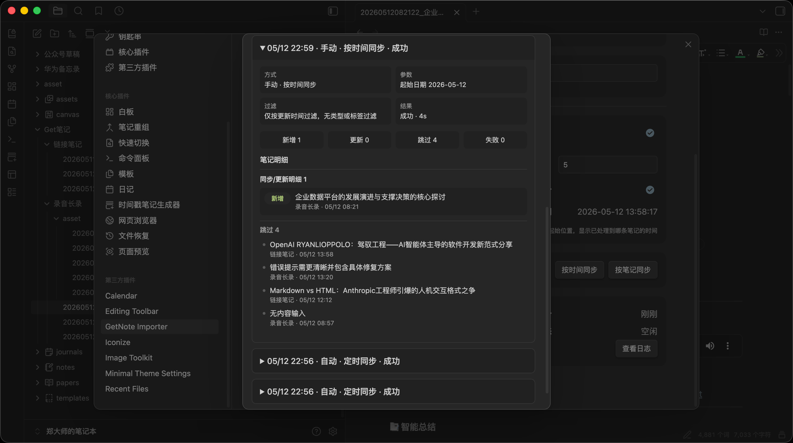
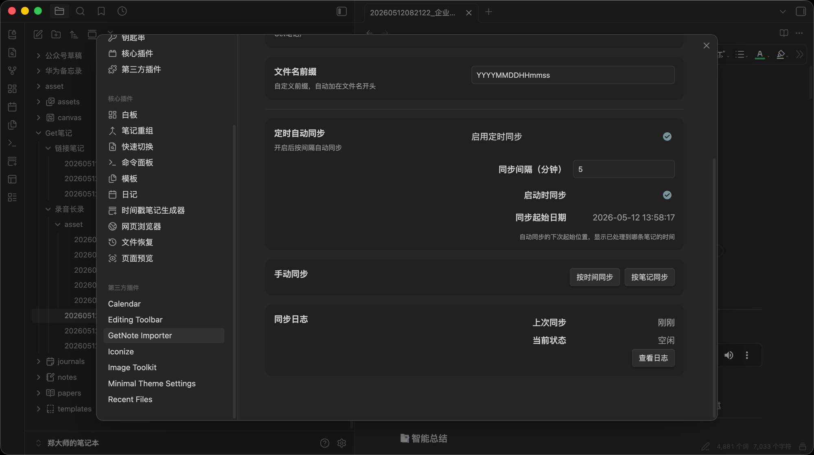
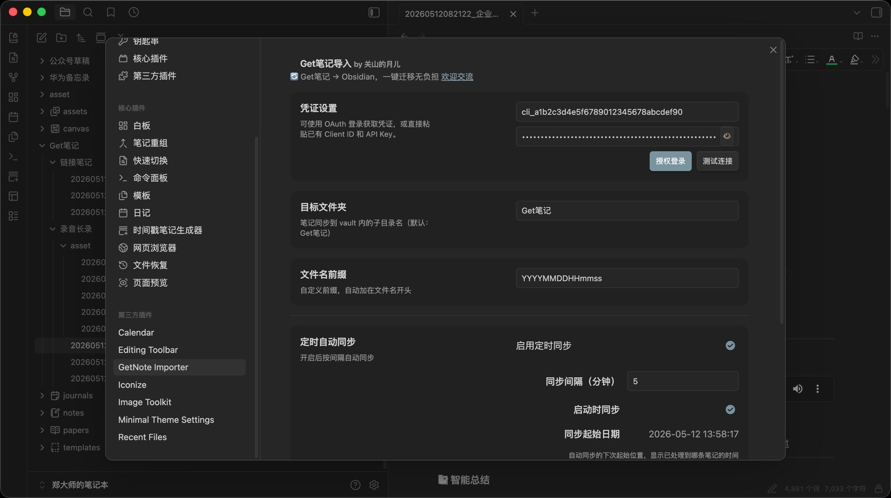
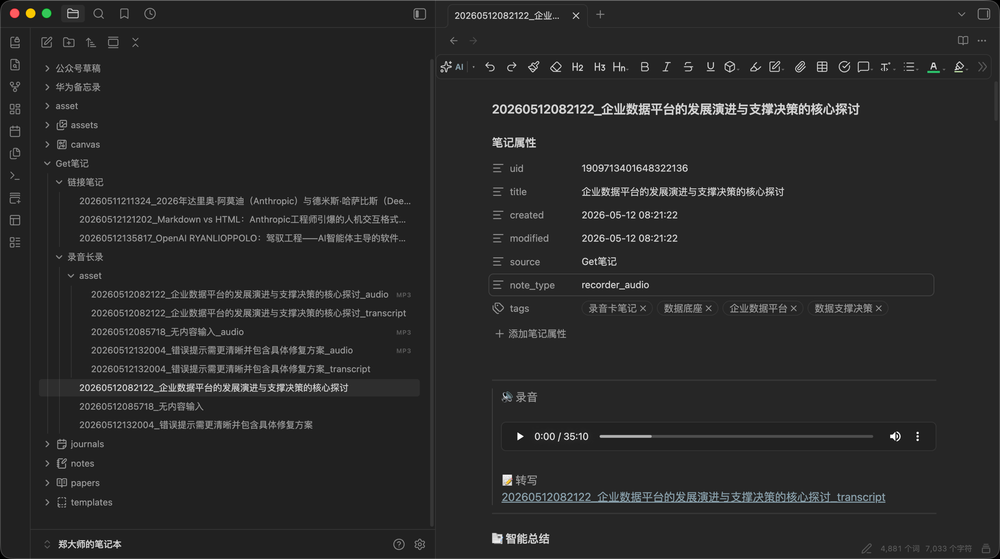

# GetNote Importer

[](https://community.obsidian.md/plugins/getnote-importer)
[](https://github.com/AndyZhengyan/obsidian-getnote-importer/releases)
[](https://community.obsidian.md/plugins/getnote-importer)
[](https://github.com/AndyZhengyan/obsidian-getnote-importer/actions)
[](LICENSE)

Bring your GetNote ideas, highlights, links, recordings, and AI summaries into Obsidian as clean, searchable Markdown.

GetNote Importer is an Obsidian plugin for people who capture in GetNote but think, connect, and build in Obsidian. It keeps imports readable from day one: title-based filenames, type-based folders, source metadata in frontmatter, incremental updates, selective sync, scheduled sync, and detailed sync history.

[中文版说明](./README_zh.md)

## Why It Feels Good

- **Readable files, not dumped data**: notes are named from their titles and organized by note type.
- **Incremental by default**: unchanged notes are skipped; updated notes are refreshed.
- **Checkpoint continuity**: scheduled sync resumes from where it left off, without re-processing the last note.
- **Selective when you need control**: pick exactly which notes to bring into Obsidian.
- **Scheduled when you want peace of mind**: keep the vault fresh in the background.
- **Audio-aware**: recording notes can include downloaded audio assets and transcript content when the GetNote API provides them.
- **Mobile-friendly networking**: API calls use Obsidian `requestUrl`, keeping the plugin suitable for desktop and mobile Obsidian.

## Why Not GetNote's Official Export?

GetNote's official export has significant limitations:

| GetNote Official Export | GetNote Importer |
| --- | --- |
| Exports as offline HTML (one giant file) | Syncs as individual Markdown files |
| Max 10,000 notes per export | No hard limit; incremental sync handles any volume |
| Manual one-time export | Scheduled auto-sync keeps your vault up to date |
| All-or-nothing export | Selective sync — choose exactly which notes to import |
| No incremental updates | Only changed notes are re-downloaded |
| Audio files need separate handling | Audio attachments downloaded and linked automatically |

If you've ever tried to find that one note in a 10,000-note HTML file, you know why this plugin exists.

## Screenshots

Settings page — credentials, filename format, scheduled sync toggle and interval.



Sync history modal — shows filter criteria, parameters, and per-note results (created, updated, skipped, failed) for each sync run.



Manual sync modal — specify a start date to sync by time range, with note details displayed in collapsible groups.



Synced recording note — includes audio file, transcript text, and AI summary, with metadata (uid, tags, source) recorded in frontmatter.



## Features

| Feature | Description |
| --- | --- |
| Incremental sync | Create new notes, update changed notes, skip unchanged notes |
| Selective sync | Choose notes from a picker before importing |
| Scheduled sync | Sync in the background on an interval |
| Startup sync | Optionally sync once when Obsidian starts |
| Type-based folders | Plain text, links, recordings, local audio, and unknown types are grouped separately |
| Title-based filenames | Uses note titles first, then content previews as fallback |
| Date prefixes | Supports patterns like `YYYY-MM-DD` and `YYYYMMDD_HHmm` |
| Conflict protection | Avoids overwriting different notes with the same title |
| Sync history | Shows per-note created, updated, skipped, and failed results |
| Auto checkpoint | Tracks last synced timestamp to avoid re-processing the same note |

## Installation

### From Obsidian Community Plugins

[](https://community.obsidian.md/plugins/getnote-importer)

1. Open `Settings -> Community plugins -> Browse`.
2. Search for `GetNote Importer`.
3. Install and enable the plugin.

### Manual Install

1. Download `main.js`, `manifest.json`, and `styles.css` from the [latest release](https://github.com/AndyZhengyan/obsidian-getnote-importer/releases/latest).
2. Put them into:

```text
<your-vault>/.obsidian/plugins/getnote-importer/
```

3. Reload Obsidian and enable `GetNote Importer`.

## Get API Credentials

> **Note**: GetNote Open API requires a **Get笔记PRO** subscription. We confirmed with the GetNote team that API costs are high, so access is currently limited to paid members only. If you are using the free tier, the Open API endpoints will not return data.

Your GetNote API credentials are stored in Obsidian plugin settings and are used only to call the GetNote Open API.

1. Open the GetNote app.
2. Go to `Settings -> Open Platform`.
3. Create an app and copy the `Token` and `Client ID`.
4. Paste them into `Settings -> GetNote Importer`.

You can also use the OAuth button in the plugin settings when available.

## Usage

### Sync Everything

Open the plugin settings and click `Sync by Time`, or run this command from the command palette:

```text
GetNote Importer: Sync Notes
```

### Pick Notes to Sync

Click `Sync by Notes`, choose the notes you want, then start syncing. This is useful for project cleanup, topic-based imports, and one-off migrations.

### Keep It Fresh

Enable scheduled sync, choose an interval, and optionally sync once when Obsidian starts.

## Output Structure

By default, notes are written under a target folder.

```text
vault/
└── Get笔记/
    ├── 纯文本/
    │   └── Meeting Notes.md
    ├── 链接笔记/
    │   └── 2026-04-30_Article Clip.md
    ├── 录音长录/
    │   ├── Recording Summary.md
    │   └── asset/
    │       ├── Recording Summary.mp3
    │       └── Recording Summary.md
    └── 其他/
        └── Unknown Type.md
```

Each Markdown note includes frontmatter so future syncs can identify and update the same GetNote item.

```yaml
---
uid: "1908723638246504120"
title: "Meeting Notes"
created: 2026-04-30 12:45:24
modified: 2026-04-30 13:00:07
source: Get笔记
note_type: recorder_audio
tags: ["work"]
---
```

## Filename Rules

| Scenario | Example |
| --- | --- |
| Note has a title | `Meeting Notes.md` |
| Note has no title | `First line of content.md` |
| Prefix is `YYYY-MM-DD` | `2026-04-30_Meeting Notes.md` |
| Same title, different note | `Meeting Notes-2.md` |

Invalid filename characters such as `\ / : * ? " < > |` are removed automatically.

## Filename Prefix

Prepend a date/time pattern to every filename. Available tokens:

| Token | Meaning | Example |
| --- | --- | --- |
| `YYYY` | 4-digit year | `2026` |
| `MM` | 2-digit month | `04` |
| `DD` | 2-digit day | `30` |
| `HH` | 2-digit hour (24h) | `14` |
| `mm` | 2-digit minute | `30` |
| `ss` | 2-digit second | `05` |

**Examples:**

| Prefix | Resulting filename |
| --- | --- |
| `YYYY-MM-DD` | `2026-04-30_Meeting Notes.md` |
| `YYYYMMDD_HHmm` | `20260430_1430_Meeting Notes.md` |
| `YYYY-MM-DD` | `2026-04-30_.md` (no title → content preview) |

The plugin replaces each token with the corresponding value from the note's `created_at` timestamp. Tokens are case-sensitive — use `mm` for minutes, not `MM` (which means month).

## Settings

| Setting | Description | Default |
| --- | --- | --- |
| Target Folder | Destination folder inside your vault | `Get笔记` |
| Filename Prefix | Date prefix format: `YYYY-MM-DD` → `2026-04-30` | empty |
| Auto Sync Range | Only sync notes updated in the last N days. `0` means no limit | `30` |
| Sync Start Date | Optional absolute start date for manual sync | empty |
| Scheduled Sync | Run sync automatically in the background | off |
| Sync Interval | Scheduled sync interval in minutes | `30` |
| Sync on Start | Run once when Obsidian starts | on |

## Sync Model

GetNote Importer treats GetNote as the source of truth for imported note content.

1. Scan the target folder and build a `uid -> file` index from frontmatter.
2. Fetch notes from the GetNote Open API.
3. Filter notes by your sync range (max days, start date, or checkpoint timestamp).
4. Create files for new notes.
5. Update files when `updated_at` changes.
6. Rename files when the display title changes.
7. Record per-note results in sync history.
8. Save the last processed note's `updated_at` as a checkpoint for the next scheduled sync.

## Privacy

- No external backend is involved.
- API credentials stay in local Obsidian plugin data.
- Note data is requested from GetNote and written directly into your vault.
- Audio attachments are downloaded only from HTTPS URLs returned by the GetNote API.

## Known Limitations

- The plugin depends on the availability and response shape of the GetNote Open API.
- Audio download works only when the detail API returns a valid HTTPS audio attachment.
- Imported Markdown content may be updated by future syncs. Keep personal edits in separate notes or backlinks if you need full manual control.

## Development

```bash
npm install
npm run typecheck
npm run lint
npm test
npm run build
```

Release assets are generated from the repository root:

- `main.js`
- `manifest.json`
- `styles.css`

The GitHub release workflow verifies typecheck, lint, tests, build, and version/tag consistency before uploading those files.

## Support

- Report bugs in [GitHub Issues](https://github.com/AndyZhengyan/obsidian-getnote-importer/issues).
- Share ideas in [GitHub Discussions](https://github.com/AndyZhengyan/obsidian-getnote-importer/discussions).
- Star the repository if it saves you time.

### About the Author

Enterprise AI practitioner, indie AI blogger, AGI believer, and enthusiast. Scan to follow my WeChat public account — let's talk.


## License

[MIT](LICENSE)