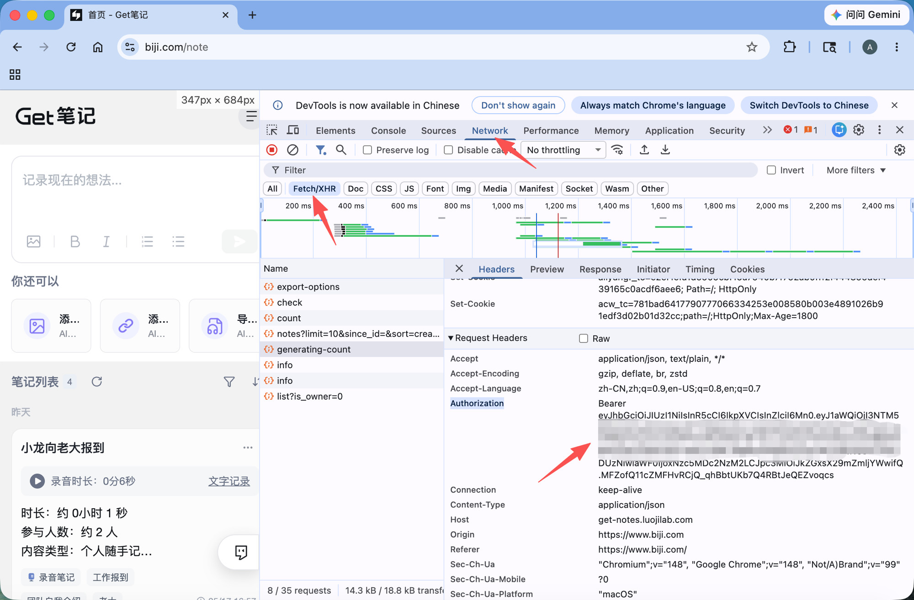

# Web Mode Manual Token Guide

Web mode is for users who cannot use GetNote OpenAPI. It reuses the signed-in GetNote Web session from your browser, so it only needs the browser session `Authorization` header and does not need `Client ID`.

## When To Use It

Use Web mode when:

- OpenAPI is unavailable for your account.
- `Test Connection` reports that OpenAPI is only available for PRO members.
- You can sign in to GetNote Web at `https://www.biji.com/note`.

Use OpenAPI mode instead if you already have a working `gk_...` OpenAPI token and `Client ID`.

## Copy The Authorization Header

1. Open `https://www.biji.com/note` in Chrome or Edge and sign in.
2. Open browser DevTools:
   - Windows/Linux: `F12` or `Ctrl + Shift + I`
   - Mac: `⌘ + ⌥ + I` (`Command + Option + I`)
3. Select the `Network` tab.
4. Select the `Fetch/XHR` filter.
5. Stay on the GetNote homepage and refresh the page so it sends API requests (no need to open the note list or any specific note).
6. Click a request whose name looks like `notes?...` or `list?...`.
7. Check the right-side `Headers` panel. The `Host` is usually `get-notes.luojilab.com`.
8. Under `Request Headers`, copy the full `Authorization` value.

The value usually starts with `Bearer eyJ...`. Keep the `Bearer ` prefix if it is copied with the token; the plugin also accepts the JWT token without the prefix.

## Paste It In Obsidian

1. Open `Settings -> GetNote Importer`.
2. Select `Temp Auth (Free)`.
3. Paste the copied `Authorization` value into the token input.
4. Click `Test Connection`.
5. After the connection succeeds, run `Sync by Time` or `Sync by Notes`.

## Common Mistakes

- Do not paste the OpenAPI `gk_...` token into Web mode.
- Do not copy `Cookie`, `Set-Cookie`, or `x-request-id`; Web mode needs `Authorization`.
- If no requests appear, keep DevTools open and refresh `https://www.biji.com/note`.
- If you cannot find `notes?...`, click around the note list or open any note to trigger another request.
- If `Test Connection` returns `401`, `403`, or "Web Token expired", refresh GetNote Web and copy a new `Authorization` header.

## Security Notes

The Web token is a browser session credential. Treat it like a password. Do not post it in issues, screenshots, logs, or chat messages.
